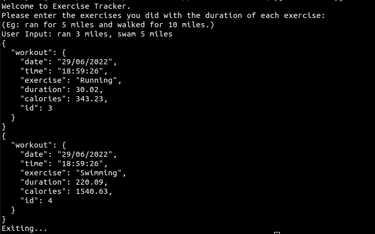
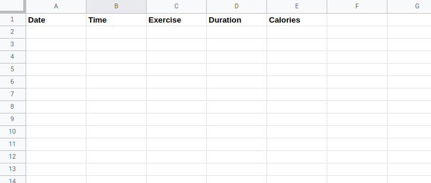
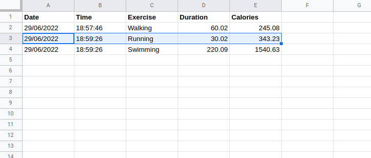

# Exercise-Tracker

### [twitter](https://twitter.com/achte_te)

## Description

A program that helps in keeping track of your Workouts and saving it into a Google Sheet. Nutrionx API is used for natural language processing and Sheety API is used to update data into a Google Sheet.

## Requirements

[Python](https://www.python.org/)

```sh
$ python3 --version
Python 3.9.12
```

[os](https://docs.python.org/3/library/os.html)

[datetime](https://docs.python.org/3/library/datetime.html)

[requests](https://pypi.org/project/requests/)

[Nutrionix API](https://developer.nutritionix.com/)

[Sheety API](https://sheety.co/)

## Install

```sh
$ git clone git@github.com:achte-2022/Exercise-Tracker.git
```

## Setting Up Environment Variables

### Environment Variables are DUMMY values

```sh
$ cd Exercise-Tracker
$ export NUTRIX_APP_ID=f564asdf
$ export NUTRIX_APP_KEY=fsd8945wqqd
$ export NUTRIX_API_END_POINT=https://trackapi.nutritionix.com/v2/natural/exercise
$ export SHEETY_API_ENDPOINT=https://api.sheety.co/asdfeqgsdf7/exercise/workout
$ export SHEETY_AUTHORIZATION='Basic Kfjwelfnv65a6sf56'
```

## Run

```sh
$ cd Exercise-Tracker
$ python3 main.py
```



## Images

### Google Sheet before Running the Program



### Google Sheet after Running the Program


